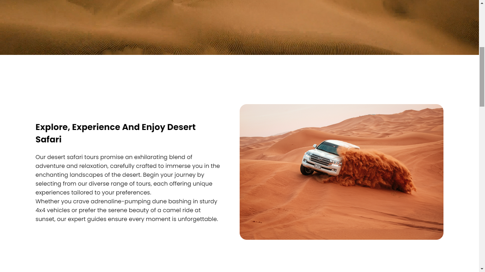

[figma design link](https://www.figma.com/design/9gC0tShzieOgUL48HLULDo/Dessert-plannet-(dev)?node-id=0-1&t=jowVAq3KpoiuI8TQ-0)

# my project : 

- single webpage
- fully responsive
- each section's styles are written in different css file
- comments in sections, to understand for later use

The code is disorganized; this is the first time I've worked on a project of this kind using only HTML, CSS, and JavaScript without a framework.

## screenshots : 

